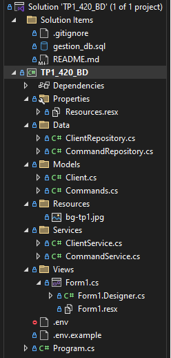

# 🖥️ Gestion de Base de Données – C# Windows Forms + SQL Server

Une application Windows Forms développée en **C# (.NET)** permettant de gérer des données stockées dans une base **SQL Server**.  
Le projet inclut des fonctionnalités de connexion, d’ajout, de modification et de suppression d’enregistrements.

---

## 🚀 Installation

### 1. Cloner le projet

git clone https://github.com/maucasoli/TP1-420-DB.git

### 2. Ouvrir dans Visual Studio

Lance Visual Studio

Clique sur "Ouvrir un projet ou une solution"

Sélectionne le fichier .sln du projet

### 3. Configurer la base de données SQL Server

Crée une base de données SQL Server (ex: gestion_db)

Mets à jour la chaîne de connexion dans ton code :

conStr = $"Server={server};Database={database};Trusted_Connection=True;TrustServerCertificate=True";

## ▶️ Utilisation

Lance l’application depuis Visual Studio

Ajoute, modifie ou supprime des enregistrements via l’interface graphique

## 🧩 Structure du projet

## 🛠️ Technologies utilisées

C# (.NET Framework / .NET 8+)

Windows Forms

SQL Server

SQL Server Management Studio 21

ADO.NET

## 📧 Auteur

Jean Guyot
💻 GitHub : @GuyotJean

Mauricio Oliveira
💻 GitHub : @maucasoli

Youssef Moinou
💻 GitHub : @derssa

## 🧑🏻‍💼 Répartition des tâches

### 1️⃣ Modélisation du projet

🧑🏻‍💼 Jean Guyot

🧑🏻‍💼 Mauricio Oliveira

🧑🏻‍💼 Youssef Moinou

### 2️⃣ Création de la base de données

🧑🏻‍💼 Jean Guyot

🧑🏻‍💼 Mauricio Oliveira

🧑🏻‍💼 Youssef Moinou

### 3️⃣ Développement backend — Clients

🧑🏻‍💼 Mauricio Oliveira

### 4️⃣ Développement backend — Commandes

🧑🏻‍💼 Jean Guyot

### 5️⃣ Développement interface graphique

🧑🏻‍💼 Youssef Moinou

### 6️⃣ Documentation

🧑🏻‍💼 Jean Guyot

🧑🏻‍💼 Mauricio Oliveira

🧑🏻‍💼 Youssef Moinou
 
## Images

